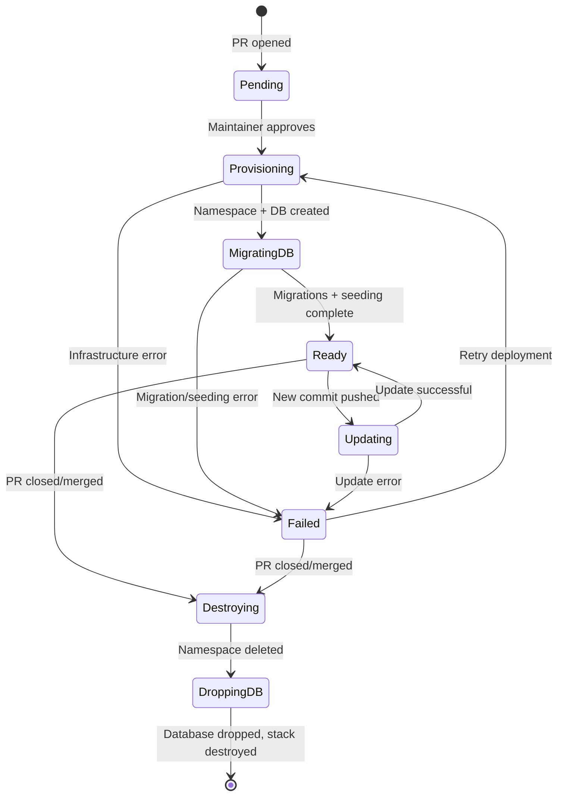

# Data Model: Pull Request Ephemeral Environments

**Phase**: 1 - Design & Contracts
**Date**: 2025-12-20 (Updated)
**Purpose**: Define entities, state, and relationships for preview environment management

---

## Overview

The ephemeral environment system manages the lifecycle of preview deployments using a **two-stack infrastructure pattern** with Pulumi. State is distributed across:

- **Persistent base infrastructure** (`ephemeral-base` Pulumi stack): Shared PostgreSQL, Gateway, DNS
- **Per-PR ephemeral resources** (`ephemeral-pr-{PR_NUMBER}` Pulumi stacks): Namespaces, deployments, per-PR databases
- **GitHub PR metadata**: Deployment status, image digests, approval tracking

No centralized application database is used for preview environment management.

---

## Entities

### 1. Preview Environment (Pulumi Stack + Kubernetes Namespace)

Represents a deployed preview environment for a specific pull request.

**Attributes**:

| Field            | Type      | Description                                           | Source                     |
| ---------------- | --------- | ----------------------------------------------------- | -------------------------- |
| `prNumber`       | integer   | Pull request number (unique identifier)               | GitHub PR                  |
| `namespaceName`  | string    | Kubernetes namespace name (`ephemeral-pr-{prNumber}`) | Derived                    |
| `webUrl`         | string    | Public web URL (`{prNumber}.pr.aphiria.com`)          | Derived                    |
| `apiUrl`         | string    | Public API URL (`{prNumber}.pr-api.aphiria.com`)      | Derived                    |
| `commitSha`      | string    | Git commit SHA currently deployed                     | GitHub PR                  |
| `webImageDigest` | string    | Immutable web image digest (sha256:...)               | Docker build output        |
| `apiImageDigest` | string    | Immutable API image digest (sha256:...)               | Docker build output        |
| `databaseName`   | string    | Logical database name (`aphiria_pr_{prNumber}`)       | Derived                    |
| `status`         | enum      | Current deployment status (see State Machine below)   | Pulumi + K8s status        |
| `createdAt`      | timestamp | When environment was first provisioned                | Pulumi stack creation time |
| `updatedAt`      | timestamp | Last deployment/update time                           | Pulumi stack update time   |
| `approvedBy`     | string    | GitHub username who approved deployment               | GitHub Actions environment |

**Kubernetes Representation**:

Namespace with labels and annotations:

```yaml
apiVersion: v1
kind: Namespace
metadata:
    name: ephemeral-pr-123
    labels:
        app.kubernetes.io/name: preview-environment
        app.kubernetes.io/instance: pr-123
        app.kubernetes.io/managed-by: pulumi
        preview.aphiria.com/pr-number: "123"
        # Image digest labels for production promotion
        preview.aphiria.com/web-image-digest: "sha256:abc123..."
        preview.aphiria.com/api-image-digest: "sha256:def456..."
    annotations:
        preview.aphiria.com/commit-sha: "abc123def456"
        preview.aphiria.com/created-at: "2025-12-20T14:32:00Z"
        preview.aphiria.com/updated-at: "2025-12-20T15:10:00Z"
        preview.aphiria.com/approved-by: "username"
        preview.aphiria.com/pr-url: "https://github.com/aphiria/aphiria.com/pull/123"
        preview.aphiria.com/database-name: "aphiria_pr_123"
```

**Pulumi Stack Outputs**:

```typescript
// ephemeral-pr-123 stack outputs
export const prNumber = 123;
export const namespace = "ephemeral-pr-123";
export const webUrl = "https://123.pr.aphiria.com";
export const apiUrl = "https://123.pr-api.aphiria.com";
export const databaseName = "aphiria_pr_123";
export const webImageDigest = "sha256:abc123...";
export const apiImageDigest = "sha256:def456...";
```

**Validation Rules**:

- `prNumber` must be positive integer
- `namespaceName` must match pattern `ephemeral-pr-[0-9]+`
- `webUrl` must be `{prNumber}.pr.aphiria.com`
- `apiUrl` must be `{prNumber}.pr-api.aphiria.com`
- `databaseName` must be `aphiria_pr_{prNumber}` (matches PostgreSQL naming rules)
- `status` must be one of valid states (see State Machine)
- `commitSha` must be valid Git SHA (40 hex characters)
- `webImageDigest` and `apiImageDigest` must be valid SHA256 digests (sha256:..., 64 hex chars)
- **Immutability**: Image digests MUST NOT change once set for a given commit SHA

---

### 2. Base Infrastructure (Pulumi Stack: `ephemeral-base`)

Represents the persistent infrastructure shared across all preview environments.

**Attributes**:

| Field                | Type   | Description                       | Lifecycle  |
| -------------------- | ------ | --------------------------------- | ---------- |
| `clusterName`        | string | Kubernetes cluster name/reference | Persistent |
| `postgresqlService`  | string | PostgreSQL service name (`db`)    | Persistent |
| `gatewayName`        | string | Gateway API gateway name          | Persistent |
| `wildcardCertSecret` | string | TLS wildcard cert secret name     | Persistent |
| `dnsWildcardZone`    | string | DNS zone (`*.pr.aphiria.com`)     | Persistent |

**Pulumi Stack Outputs**:

```typescript
// ephemeral-base stack outputs
export const postgresqlHost = "db.default.svc.cluster.local"; // or shared namespace
export const postgresqlPort = 5432;
export const gatewayNamespace = "gateway-system";
export const gatewayName = "aphiria-gateway";
export const wildcardTlsSecret = "wildcard-pr-aphiria-com";
```

**Lifecycle**:

- Deployed once manually or via separate workflow
- Never destroyed by PR workflows
- Updates manual as-needed (clarified in research.md)

---

### 3. Per-PR Database (Logical Database in Shared PostgreSQL)

Represents the isolated database for a preview environment.

**Attributes**:

| Field               | Type      | Description                                        | Source           |
| ------------------- | --------- | -------------------------------------------------- | ---------------- |
| `databaseName`      | string    | PostgreSQL database name (`aphiria_pr_{prNumber}`) | Derived          |
| `ownerUser`         | string    | Database owner user (shared or per-PR)             | ConfigMap/Secret |
| `connectionString`  | string    | Database connection string                         | ConfigMap        |
| `createdAt`         | timestamp | When database was created                          | Pulumi stack     |
| `migrationsApplied` | boolean   | Whether Phinx migrations ran successfully          | Job status       |
| `lexemesSeeded`     | boolean   | Whether LexemeSeeder populated search index        | Job status       |

**PostgreSQL Representation**:

```sql
-- Created by Pulumi on stack creation
CREATE DATABASE aphiria_pr_123;

-- Migrations and seeding run by db-migration Job
-- Tables created within aphiria_pr_123 database
```

**ConfigMap Representation** (per-PR):

```yaml
apiVersion: v1
kind: ConfigMap
metadata:
    name: env-vars
    namespace: ephemeral-pr-123
data:
    DB_HOST: "db" # Shared PostgreSQL service
    DB_NAME: "aphiria_pr_123" # PR-specific database
    DB_PORT: "5432"
    APP_WEB_URL: "https://123.pr.aphiria.com"
    APP_API_URL: "https://123.pr-api.aphiria.com"
    APP_ENV: "preview"
    LOG_LEVEL: "debug"
```

**Cleanup**:

- On PR close: `DROP DATABASE IF EXISTS aphiria_pr_{PR_NUMBER}`
- Executed by Pulumi during stack destroy
- Verification step ensures database removed

---

### 4. Deployment Status (PR Comment + Pulumi State)

Tracks current state and progress of a preview environment deployment.

**Attributes**:

| Field                | Type              | Description                             | Source                       |
| -------------------- | ----------------- | --------------------------------------- | ---------------------------- |
| `prNumber`           | integer           | Associated pull request                 | GitHub PR                    |
| `status`             | enum              | Overall deployment status               | Computed from Pulumi + K8s   |
| `webReplicas`        | string            | Web deployment status (e.g., "1/1")     | Kubernetes Deployment status |
| `apiReplicas`        | string            | API deployment status (e.g., "1/1")     | Kubernetes Deployment status |
| `databaseReady`      | boolean           | Database created and migrations applied | Pulumi + Job status          |
| `httpRouteReady`     | boolean           | HTTPRoute configured and healthy        | Gateway API status           |
| `errorMessage`       | string (optional) | Error description if status=failed      | Workflow logs                |
| `lastDeployedCommit` | string            | Last successfully deployed commit SHA   | Namespace annotation         |

**GitHub PR Comment Representation**:

```markdown
## 🚀 Preview Environment

**Status**: ✅ Ready | 🔄 Deploying | ❌ Failed | 🗑️ Destroying
**Web URL**: https://123.pr.aphiria.com
**API URL**: https://123.pr-api.aphiria.com
**Last Updated**: 2025-12-20 15:10 UTC
**Commit**: abc1234

---

<details>
<summary>Deployment Details</summary>

- Pulumi Stack: `ephemeral-pr-123`
- Namespace: `ephemeral-pr-123`
- Database: `aphiria_pr_123` ✅ Ready
- Web: ✅ Ready (1/1 replicas)
- API: ✅ Ready (1/1 replicas)
- HTTPRoute: ✅ Configured
- Migrations: ✅ Applied
- Search Index: ✅ Populated

</details>
```

---

### 5. Production Promotion Record

Tracks the image digest promotion from preview to production deployment.

**Attributes**:

| Field            | Type      | Description                         | Source                    |
| ---------------- | --------- | ----------------------------------- | ------------------------- |
| `prNumber`       | integer   | PR that was merged to production    | GitHub PR                 |
| `commitSha`      | string    | Git commit deployed to production   | Merged PR                 |
| `webImageDigest` | string    | Web image digest deployed           | Preview environment label |
| `apiImageDigest` | string    | API image digest deployed           | Preview environment label |
| `promotedAt`     | timestamp | When promotion occurred             | Workflow execution time   |
| `promotedBy`     | string    | Who triggered production deployment | GitHub user               |

**Storage**: GitHub PR Labels (visible, queryable)

After preview deployment succeeds, these labels are added to the PR:

```
image-digest/web:sha256:abc123...
image-digest/api:sha256:def456...
```

Production deployment workflow reads these labels from the merged PR to deploy the exact same images.

**Validation**:

- Image digests MUST match what was deployed in preview
- Production MUST NOT rebuild images
- Promotion workflow MUST verify digest exists before deploying

---

## State Machine

### Preview Environment Lifecycle States



**State Descriptions**:

| State            | Description                                                | Actions                         | Exit Condition                  |
| ---------------- | ---------------------------------------------------------- | ------------------------------- | ------------------------------- |
| **Pending**      | PR open, awaiting approval                                 | Display approval prompt in PR   | Maintainer approves deployment  |
| **Provisioning** | Creating Pulumi stack, namespace, deploying K8s resources  | Post "deploying" status to PR   | Stack up complete OR error      |
| **MigratingDB**  | Running db-migration Job (Phinx migrations + LexemeSeeder) | Monitor Job status              | Job complete OR error           |
| **Ready**        | Environment fully operational, search working              | Post URLs and status to PR      | New commit OR PR closed         |
| **Updating**     | Deploying new commit to existing env (pulumi up)           | Update PR comment with progress | Deployment complete OR error    |
| **Failed**       | Deployment/migration error occurred                        | Post error details to PR        | Manual retry OR PR closed       |
| **Destroying**   | Namespace deletion in progress                             | Post "cleaning up" status       | Namespace deleted               |
| **DroppingDB**   | Dropping PR database from shared PostgreSQL                | Pulumi executing database drop  | Database dropped, stack removed |

---

## Relationships

### 1. Pull Request → Preview Environment (1:1)

- Each PR can have **at most one** preview environment
- Preview environment identified by PR number and Pulumi stack name
- Relationship established when maintainer approves first deployment
- Relationship destroyed when PR is closed/merged (stack destroy)

### 2. Base Infrastructure → Preview Environments (1:N)

- One `ephemeral-base` stack supports many `ephemeral-pr-*` stacks
- Shared PostgreSQL instance hosts N per-PR databases
- Shared Gateway routes to N preview HTTPRoutes
- Shared wildcard TLS cert used by all previews

### 3. Preview Environment → Kubernetes Resources (1:N)

Each preview environment Pulumi stack manages:

- 1 Namespace
- 2 Deployments (Web: 1 replica, API: 1 replica)
- 2 Services (Web, API - ClusterIP)
- 1 HTTPRoute (Gateway API, routes both web and API hostnames)
- 1 ConfigMap (`env-vars`)
- 1 Secret (`env-var-secrets` with DB credentials)
- 1 Job (`db-migration` - runs Phinx migrations + LexemeSeeder)
- 1 ResourceQuota (2 CPU, 4Gi memory, 5 pods max)
- 1 NetworkPolicy (namespace isolation)
- 1 Logical Database (in shared PostgreSQL)

All Kubernetes resources are in the preview namespace; namespace deletion cascades to all resources.

### 4. GitHub Actions Workflow → Preview Environment (N:1)

Multiple workflow runs can target the same preview environment:

- Initial deployment (create Pulumi stack)
- Update deployments (pulumi up on new commits)
- Cleanup deployment (pulumi destroy on PR close)

Workflow runs are stateless; environment state stored in Pulumi stack + Kubernetes.

---

## Data Flows

### 1. Preview Creation Flow

```
PR Opened
  → Workflow triggers (pending approval)
  → Maintainer approves via GitHub UI
  → Workflow reads PR metadata (number, SHA, branch)
  → Build Docker images → push to registry → capture digests
  → Initialize Pulumi stack: ephemeral-pr-{PR_NUMBER}
  → Pulumi creates:
      - Kubernetes namespace
      - PostgreSQL database (CREATE DATABASE)
      - ConfigMap/Secret with PR-specific config
      - Deployments (web, api) with image digests
      - HTTPRoute for routing
      - db-migration Job
  → Wait for Job to complete (migrations + LexemeSeeder)
  → Wait for Deployments to be ready
  → Export stack outputs (URLs, database name)
  → Update PR comment with URLs and status
```

### 2. Preview Update Flow

```
New Commit Pushed
  → Workflow triggers (runs in context of PR)
  → Build Docker images → push to registry → capture new digests
  → Check if Pulumi stack exists
  → If exists: pulumi up with updated image digests
  → Pulumi updates Deployment image references
  → Kubernetes performs rolling update
  → Optionally re-run db-migration Job if schema changed
  → Wait for new pods to be ready
  → Update PR comment with new commit SHA
```

### 3. Preview Cleanup Flow

```
PR Closed/Merged
  → Workflow triggers (automatic, no approval needed)
  → pulumi destroy --stack ephemeral-pr-{PR_NUMBER} --yes
  → Pulumi execution:
      1. Drop database: DROP DATABASE IF EXISTS aphiria_pr_{PR_NUMBER}
      2. Delete Kubernetes namespace (cascades to all resources)
      3. Remove stack state
  → Verify database removed (query pg_database)
  → Update PR comment: "Preview environment destroyed"
```

---

## Validation and Constraints

### Namespace Naming

- Pattern: `^ephemeral-pr-[0-9]+$`
- Example: `ephemeral-pr-123`
- Ensures uniqueness and discoverability

### Database Naming

- Pattern: `^aphiria_pr_[0-9]+$`
- Example: `aphiria_pr_123`
- Must be valid PostgreSQL database name
- Must not conflict with production databases

### Resource Limits (per Preview)

Enforced via ResourceQuota in namespace (clarified 2025-12-20):

```yaml
requests.cpu: "2"
requests.memory: "4Gi"
limits.cpu: "2"
limits.memory: "4Gi"
count/pods: "5"
```

Prevents single preview from consuming excessive cluster resources.

**Deployment Replicas** (preview-specific):

- Web: 1 replica (vs. 2 in production)
- API: 1 replica (vs. 2 in production)

### Concurrency Limits

- Maximum concurrent previews: ~10 (limited by cluster capacity, not enforced)
- Check existing Pulumi stacks before creating new preview
- Fail fast if cluster resources exhausted

### Data Retention

- Preview data is ephemeral
- Database dropped on PR close (no backups)
- No persistent storage beyond PR lifecycle
- Use seed data, not production data

---

## Image Digest Tracking

### Build-Once-Deploy-Many Strategy

**Goal**: Ensure preview and production run identical container images.

**Flow**:

1. **Build Phase** (GitHub Actions on PR push):

    ```yaml
    - name: Build and push web image
      id: build-web
      uses: docker/build-push-action@v5
      with:
          tags: davidbyoung/aphiria.com-web:pr-${{ github.event.pull_request.number }}
      # Outputs: digest (sha256:abc123...)
    ```

2. **Preview Deployment** (Pulumi):

    ```typescript
    const webDeployment = new k8s.apps.v1.Deployment("web", {
        spec: {
            template: {
                spec: {
                    containers: [
                        {
                            name: "web",
                            image: `davidbyoung/aphiria.com-web@${webImageDigest}`, // Use digest
                        },
                    ],
                },
            },
        },
    });
    ```

3. **Promotion Tracking** (PR Labels):
    - After successful preview deployment, GitHub Actions adds labels to PR
    - Labels: `image-digest/web:sha256:abc123...`, `image-digest/api:sha256:def456...`

4. **Production Deployment** (on merge):
    - Read labels from merged PR
    - Deploy to production using same digests
    - **No rebuild** - guaranteed identical images

---

## Summary

The data model leverages a **hybrid approach**:

- **Persistent base infrastructure** (Pulumi `ephemeral-base` stack): Shared PostgreSQL, Gateway, DNS
- **Ephemeral per-PR resources** (Pulumi `ephemeral-pr-*` stacks): Namespaces, deployments, databases
- **State storage**: Pulumi state (infrastructure), Kubernetes resources (runtime), GitHub PR metadata (status, digests)
- **Cleanup**: Pulumi destroy guarantees removal of all resources (namespace cascades K8s, explicit database drop)

This design:

- **Cost-effective**: Shared PostgreSQL (70-80% cheaper than per-PR instances)
- **Fast provisioning**: Database creation ~2 seconds (vs. ~2 minutes for full PostgreSQL deployment)
- **Reliable cleanup**: Pulumi tracks all resources, database drop explicit
- **Immutable promotion**: Build-once-deploy-many via image digests
- **No external state**: Leverages existing infrastructure (Pulumi, Kubernetes, GitHub)
