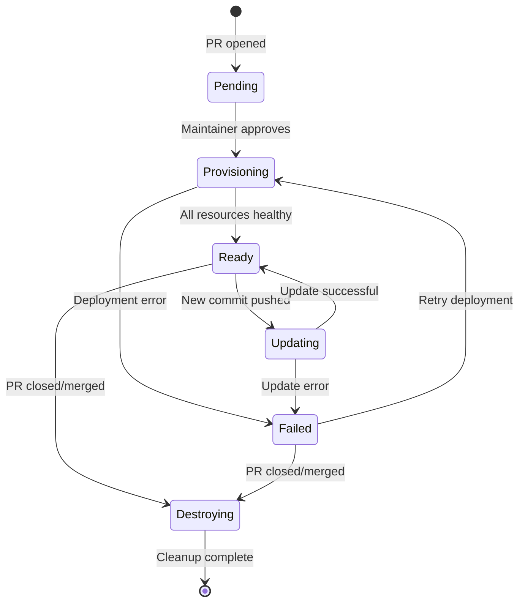

# Data Model: Pull Request Ephemeral Environments

**Phase**: 1 - Design & Contracts
**Date**: 2025-12-19
**Purpose**: Define entities, state, and relationships for preview environment management

---

## Overview

The ephemeral environment system manages the lifecycle of preview deployments. State is distributed across Kubernetes resources, GitHub PR metadata, and GitHub Actions workflow state. No centralized database is used.

---

## Entities

### 1. Preview Environment (Kubernetes Namespace)

Represents a deployed preview environment for a specific pull request.

**Attributes**:

| Field | Type | Description | Source |
|-------|------|-------------|--------|
| `prNumber` | integer | Pull request number (unique identifier) | GitHub PR |
| `namespaceName` | string | Kubernetes namespace name (`preview-pr-{prNumber}`) | Derived |
| `url` | string | Public URL for preview (`{prNumber}.pr.aphiria.com`) | Derived |
| `commitSha` | string | Git commit SHA currently deployed | GitHub PR |
| `webImageDigest` | string | **NEW** Immutable web image digest (sha256:...) | Docker build output |
| `apiImageDigest` | string | **NEW** Immutable API image digest (sha256:...) | Docker build output |
| `status` | enum | Current deployment status (see State Machine below) | Kubernetes + workflow |
| `createdAt` | timestamp | When environment was first provisioned | Namespace creation time |
| `updatedAt` | timestamp | Last deployment/update time | Namespace annotation |
| `approvedBy` | string | GitHub username who approved deployment | GitHub Actions environment |

**Kubernetes Representation**:

Namespace with labels and annotations:

```yaml
apiVersion: v1
kind: Namespace
metadata:
  name: preview-pr-123
  labels:
    app.kubernetes.io/name: preview-environment
    app.kubernetes.io/instance: pr-123
    app.kubernetes.io/managed-by: github-actions
    preview.aphiria.com/pr-number: "123"
    # NEW: Image digest labels for production promotion
    preview.aphiria.com/web-image-digest: "sha256:abc123..."
    preview.aphiria.com/api-image-digest: "sha256:def456..."
  annotations:
    preview.aphiria.com/commit-sha: "abc123def456"
    preview.aphiria.com/created-at: "2025-12-19T14:32:00Z"
    preview.aphiria.com/updated-at: "2025-12-19T15:10:00Z"
    preview.aphiria.com/approved-by: "username"
    preview.aphiria.com/pr-url: "https://github.com/aphiria/aphiria.com/pull/123"
```

**Validation Rules**:

- `prNumber` must be positive integer
- `namespaceName` must match pattern `preview-pr-[0-9]+`
- `url` must be `{prNumber}.pr.aphiria.com`
- `status` must be one of valid states (see State Machine)
- `commitSha` must be valid Git SHA (40 hex characters)
- `webImageDigest` must be valid SHA256 digest (sha256:..., 64 hex chars)
- `apiImageDigest` must be valid SHA256 digest (sha256:..., 64 hex chars)
- **Immutability**: Image digests MUST NOT change once set for a given commit SHA

---

### 2. Deployment Status (PR Comment + K8s Status)

Tracks current state and progress of a preview environment deployment.

**Attributes**:

| Field | Type | Description | Source |
|-------|------|-------------|--------|
| `prNumber` | integer | Associated pull request | GitHub PR |
| `status` | enum | Overall deployment status | Computed from K8s resources |
| `webReplicas` | string | Web deployment status (e.g., "2/2") | Kubernetes Deployment status |
| `apiReplicas` | string | API deployment status (e.g., "2/2") | Kubernetes Deployment status |
| `databaseReady` | boolean | PostgreSQL StatefulSet ready | Kubernetes StatefulSet status |
| `ingressReady` | boolean | Ingress configured and healthy | Kubernetes Ingress status |
| `errorMessage` | string (optional) | Error description if status=failed | Workflow logs |
| `lastDeployedCommit` | string | Last successfully deployed commit SHA | Namespace annotation |

**GitHub PR Comment Representation**:

```markdown
## 🚀 Preview Environment

**Status**: ✅ Ready | 🔄 Deploying | ❌ Failed | 🗑️ Destroying
**URL**: https://123.pr.aphiria.com
**Last Updated**: 2025-12-19 15:10 UTC
**Commit**: abc1234

---

<details>
<summary>Deployment Details</summary>

- Namespace: `preview-pr-123`
- Database: ✅ Ready
- Web: ✅ Ready (2/2 replicas)
- API: ✅ Ready (2/2 replicas)
- Ingress: ✅ Configured

</details>
```

---

### 3. Preview Configuration (Kustomize Overlay)

Template and configuration for generating preview environment resources.

**Attributes**:

| Field | Type | Description | Derived From |
|-------|------|-------------|--------------|
| `prNumber` | integer | Pull request number | GitHub event |
| `namespace` | string | Target namespace | `preview-pr-{prNumber}` |
| `imageDigest` | string | **NEW** Docker image digest (immutable) | Build workflow output |
| `hostname` | string | Ingress hostname | `{prNumber}.pr.aphiria.com` |
| `resourceLimits` | object | CPU/memory limits | Fixed template values |
| `tlsSecretName` | string | TLS certificate secret | `wildcard-pr-aphiria-com` |

**Example Values (Generated by Workflow)**:

```yaml
# Generated kustomization overlay
apiVersion: kustomize.config.k8s.io/v1beta1
kind: Kustomization

namespace: preview-pr-123

commonLabels:
  preview.aphiria.com/pr-number: "123"

images:
  - name: aphiria.com-web
    newName: ghcr.io/aphiria/aphiria.com/web@sha256:abc123...  # Use digest, not tag
  - name: aphiria.com-api
    newName: ghcr.io/aphiria/aphiria.com/api@sha256:def456...  # Use digest, not tag

patches:
  - patch: |-
      - op: replace
        path: /spec/rules/0/host
        value: 123.pr.aphiria.com
    target:
      kind: Ingress
      name: preview-ingress
```

---

### 4. Production Promotion Record (NEW)

Tracks the image digest promotion from preview to production deployment.

**Attributes**:

| Field | Type | Description | Source |
|-------|------|-------------|--------|
| `prNumber` | integer | PR that was merged to production | GitHub PR |
| `commitSha` | string | Git commit deployed to production | Merged PR |
| `webImageDigest` | string | Web image digest deployed | Preview environment label |
| `apiImageDigest` | string | API image digest deployed | Preview environment label |
| `promotedAt` | timestamp | When promotion occurred | Workflow execution time |
| `promotedBy` | string | Who triggered production deployment | GitHub user |

**Storage**: GitHub PR Labels (visible, queryable)

After preview deployment succeeds, these labels are added to the PR:

```
image-digest/web:sha256:abc123...
image-digest/api:sha256:def456...
```

Production deployment workflow reads these labels from the merged PR to deploy the exact same images.

**Validation**:
- Image digests MUST match what was deployed in preview
- Production MUST NOT rebuild images
- Promotion workflow MUST verify digest exists before deploying

---

## State Machine

### Preview Environment Lifecycle States



**State Descriptions**:

| State | Description | Actions | Exit Condition |
|-------|-------------|---------|----------------|
| **Pending** | PR open, awaiting approval | Display approval prompt in PR | Maintainer approves deployment |
| **Provisioning** | Creating namespace, deploying resources | Post "deploying" status to PR | All pods ready OR error |
| **Ready** | Environment fully operational | Post URL and status to PR | New commit OR PR closed |
| **Updating** | Deploying new commit to existing env | Update PR comment with progress | Deployment complete OR error |
| **Failed** | Deployment error occurred | Post error details to PR | Manual retry OR PR closed |
| **Destroying** | Namespace deletion in progress | Post "cleaning up" status | Namespace deleted |

---

## Relationships

### 1. Pull Request → Preview Environment (1:1)

- Each PR can have **at most one** preview environment
- Preview environment identified by PR number
- Relationship established when maintainer approves first deployment
- Relationship destroyed when PR is closed/merged

### 2. Preview Environment → Kubernetes Resources (1:N)

Each preview environment owns:
- 1 Namespace
- 1 StatefulSet (PostgreSQL)
- 2 Deployments (Web, API)
- 3 Services (PostgreSQL, Web, API)
- 1 Ingress
- 2-3 PersistentVolumeClaims
- 1 ResourceQuota
- 1 Secret (database credentials)

All resources have `ownerReferences` or are in the preview namespace for cascading deletion.

### 3. GitHub Actions Workflow → Preview Environment (N:1)

Multiple workflow runs can target the same preview environment:
- Initial deployment (create)
- Update deployments (on new commits)
- Cleanup deployment (on PR close)

Workflow runs are stateless; environment state stored in Kubernetes.

---

## Data Flows

### 1. Preview Creation Flow

```
PR Opened
  → Workflow triggers (pending approval)
  → Maintainer approves via GitHub UI
  → Workflow reads PR metadata (number, SHA, branch)
  → Generate Kustomize overlay with PR-specific values
  → Apply Kubernetes manifests
  → Wait for resources to become ready
  → Update PR comment with URL and status
```

### 2. Preview Update Flow

```
New Commit Pushed
  → Workflow triggers (runs in context of PR)
  → Check if preview environment exists (kubectl get namespace)
  → If exists: Update image tag in Deployment
  → Trigger rollout restart
  → Wait for new pods to be ready
  → Update PR comment with new commit SHA
```

### 3. Preview Cleanup Flow

```
PR Closed/Merged
  → Workflow triggers (automatic, no approval needed)
  → Delete namespace: kubectl delete namespace preview-pr-{prNumber}
  → Wait for deletion to complete (verify PVCs removed)
  → Update PR comment: "Preview environment destroyed"
```

---

## Validation and Constraints

### Namespace Naming

- Pattern: `^preview-pr-[0-9]+$`
- Example: `preview-pr-123`
- Ensures uniqueness and discoverability

### Resource Limits (per Preview)

Enforced via ResourceQuota in namespace:

```yaml
limits.cpu: "4"
limits.memory: "4Gi"
requests.cpu: "2"
requests.memory: "2Gi"
persistentvolumeclaims: "3"
```

Prevents single preview from consuming excessive cluster resources.

### Concurrency Limits

- Maximum concurrent previews: 10 (enforced at workflow level)
- Check existing namespaces before creating new preview
- Fail fast if limit reached, post message to PR

### Data Retention

- Preview data is ephemeral
- PostgreSQL PVC deleted with namespace
- No backups of preview databases
- Use seed data, not production data

---

## Summary

The data model is **stateless from the application perspective**:
- State stored in Kubernetes native resources (Namespaces, Deployments, etc.)
- Status communicated via GitHub PR comments (user-facing)
- No external database or state store required
- Cleanup via namespace deletion ensures no orphaned resources

This design leverages existing infrastructure (Kubernetes, GitHub) without introducing additional state management complexity.
