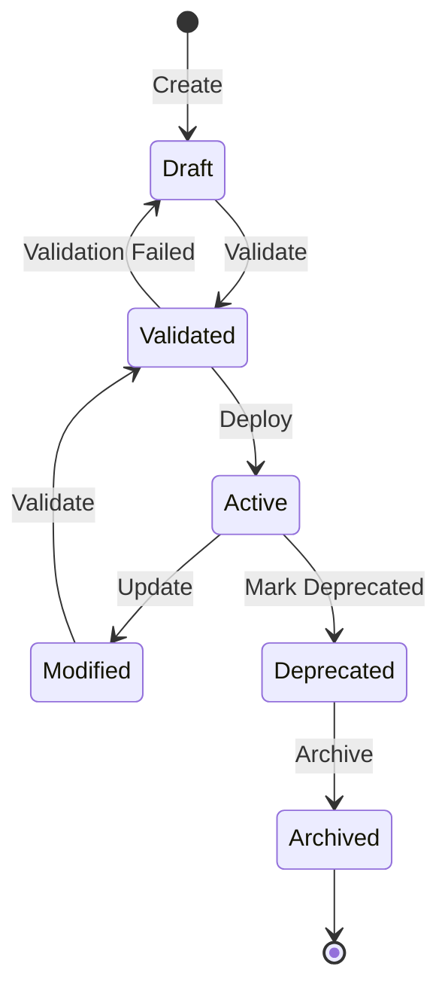
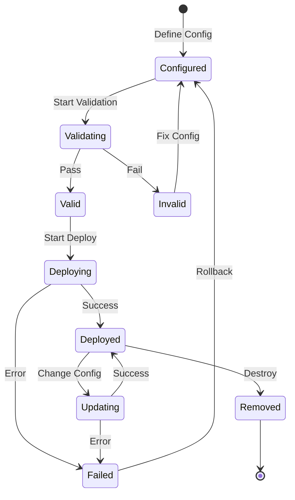
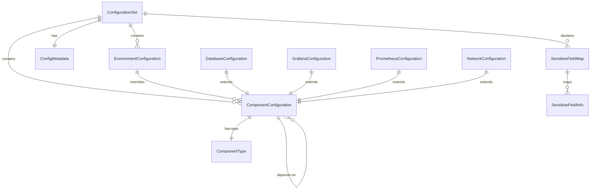

# Data Model: Infrastructure Configuration Extraction

**Feature**: Infrastructure Configuration Extraction
**Date**: 2026-01-07
**Version**: 1.0.0

## Core Entities

### ConfigurationSet

Represents a complete configuration for an infrastructure deployment.

```typescript
interface ConfigurationSet {
  // Semantic version of configuration schema
  version: string;

  // Project metadata
  metadata: ConfigMetadata;

  // Base configuration (shared defaults)
  base: BaseConfiguration;

  // Environment-specific overrides
  environments: Record<string, EnvironmentConfiguration>;

  // Component-specific configurations
  components: Record<string, ComponentConfiguration>;

  // Sensitive field declarations
  sensitive: SensitiveFieldMap;
}

interface ConfigMetadata {
  project: string;
  owner: string;
  createdAt: string;
  modifiedAt: string;
  tags: Record<string, string>;
}
```

### ComponentConfiguration

Configuration for a specific infrastructure component.

```typescript
interface ComponentConfiguration {
  // Component identifier
  name: string;

  // Component type (database, monitoring, networking)
  type: ComponentType;

  // Whether component is enabled
  enabled: boolean;

  // Component-specific settings
  settings: Record<string, any>;

  // Default values (defined by component)
  defaults?: Record<string, any>;

  // Dependencies on other components
  dependencies?: string[];
}

enum ComponentType {
  Database = 'database',
  Monitoring = 'monitoring',
  Networking = 'networking',
  Security = 'security',
  Storage = 'storage',
  Compute = 'compute'
}
```

### EnvironmentConfiguration

Environment-specific configuration overrides.

```typescript
interface EnvironmentConfiguration {
  // Environment name
  name: EnvironmentName;

  // Override values for base config
  overrides: Partial<BaseConfiguration>;

  // Component-specific overrides
  componentOverrides: Record<string, Partial<ComponentConfiguration>>;

  // Environment-specific metadata
  metadata?: {
    region?: string;
    cluster?: string;
    tier?: 'development' | 'staging' | 'production';
  };
}

enum EnvironmentName {
  Local = 'local',
  Development = 'development',
  Preview = 'preview',
  Staging = 'staging',
  Production = 'production'
}
```

### SensitiveFieldMap

Tracks which configuration fields contain sensitive data.

```typescript
interface SensitiveFieldMap {
  // Map of field paths to sensitivity info
  fields: Record<string, SensitiveFieldInfo>;
}

interface SensitiveFieldInfo {
  // Dot-notation path to field
  path: string;

  // Type of sensitive data
  type: SensitiveDataType;

  // How to handle the sensitive value
  handling: SensitiveHandling;

  // External reference (if applicable)
  reference?: string;
}

enum SensitiveDataType {
  Password = 'password',
  ApiKey = 'api_key',
  Certificate = 'certificate',
  PrivateKey = 'private_key',
  Token = 'token',
  Secret = 'secret'
}

enum SensitiveHandling {
  Mask = 'mask',           // Hide in logs
  Encrypt = 'encrypt',     // Encrypt at rest
  External = 'external',   // Reference external secret
  Pulumi = 'pulumi'       // Use Pulumi secrets
}
```

## Component-Specific Models

### DatabaseConfiguration

```typescript
interface DatabaseConfiguration extends ComponentConfiguration {
  type: ComponentType.Database;
  settings: {
    engine: 'postgresql' | 'mysql' | 'mongodb';
    version: string;
    storage: {
      size: string;  // "10Gi"
      class: string;
    };
    replicas?: number;
    backup?: {
      enabled: boolean;
      schedule: string;
      retention: string;
    };
    healthCheck?: {
      interval: string;
      timeout: string;
      retries: number;
    };
  };
}
```

### MonitoringConfiguration

```typescript
interface GrafanaConfiguration extends ComponentConfiguration {
  type: ComponentType.Monitoring;
  settings: {
    adminEmail: string;
    replicas?: number;
    tls?: {
      enabled: boolean;
      issuer: string;
      domains: string[];
    };
    datasources?: DataSource[];
    dashboards?: Dashboard[];
    alerts?: AlertRule[];
  };
}

interface PrometheusConfiguration extends ComponentConfiguration {
  type: ComponentType.Monitoring;
  settings: {
    retention: string;
    scrapeInterval: string;
    evaluationInterval: string;
    replicas?: number;
    storage?: {
      size: string;
    };
    scrapeConfigs?: ScrapeConfig[];
    rules?: PrometheusRule[];
    rbac?: RBACConfig;
  };
}
```

### NetworkingConfiguration

```typescript
interface NetworkConfiguration extends ComponentConfiguration {
  type: ComponentType.Networking;
  settings: {
    ingress?: {
      enabled: boolean;
      class: string;
      annotations: Record<string, string>;
    };
    loadBalancer?: {
      enabled: boolean;
      type: string;
      annotations: Record<string, string>;
    };
    tls?: {
      enabled: boolean;
      certificates: TLSCertificate[];
    };
  };
}
```

## Validation Schemas

### Zod Schema Examples

```typescript
import { z } from 'zod';

// Base configuration schema
const BaseConfigSchema = z.object({
  version: z.string().regex(/^\d+\.\d+\.\d+$/),
  metadata: z.object({
    project: z.string().min(1),
    owner: z.string().email(),
    tags: z.record(z.string())
  })
});

// Component configuration schema
const ComponentConfigSchema = z.object({
  name: z.string().min(1),
  type: z.enum(['database', 'monitoring', 'networking']),
  enabled: z.boolean().default(true),
  settings: z.record(z.any()),
  dependencies: z.array(z.string()).optional()
});

// Database-specific schema
const DatabaseConfigSchema = ComponentConfigSchema.extend({
  type: z.literal('database'),
  settings: z.object({
    engine: z.enum(['postgresql', 'mysql', 'mongodb']),
    version: z.string(),
    storage: z.object({
      size: z.string().regex(/^\d+[GM]i$/),
      class: z.string()
    }),
    replicas: z.number().min(1).max(10).optional()
  })
});
```

## State Transitions

### Configuration Lifecycle



### Component State



## Relationships

### Entity Relationship Diagram



## Data Flow

### Configuration Resolution Flow

1. **Load Base Configuration**
   - Read base configuration file
   - Apply component defaults
   - Validate against base schema

2. **Apply Environment Overrides**
   - Load environment-specific configuration
   - Deep merge with base configuration
   - Validate merged configuration

3. **Resolve Sensitive Values**
   - Identify sensitive fields from map
   - Fetch values from external sources
   - Apply Pulumi secret wrapping

4. **Component Instantiation**
   - Pass resolved configuration to component
   - Component uses pure function transformation
   - Return infrastructure resources

## Constraints

### Validation Rules

1. **Version Compatibility**
   - Configuration version must match schema version
   - Breaking changes require version bump

2. **Dependency Ordering**
   - Components can only depend on previously defined components
   - Circular dependencies are prohibited

3. **Environment Specificity**
   - Environment overrides cannot introduce new components
   - Only existing component settings can be overridden

4. **Sensitive Data**
   - Sensitive fields must be explicitly marked
   - Sensitive values cannot have defaults
   - Sensitive values must use secure storage

5. **Type Safety**
   - All configuration must match TypeScript interfaces
   - Runtime validation must match compile-time types


---

## Summary

The data model provides:

1. **Clear separation** between configuration and components
2. **Type safety** through TypeScript interfaces and Zod schemas
3. **Flexibility** via environment overrides and defaults
4. **Security** through explicit sensitive field handling
5. **Simplicity** through direct refactoring without legacy support

All entities are designed to be serializable, validatable, and versionable.