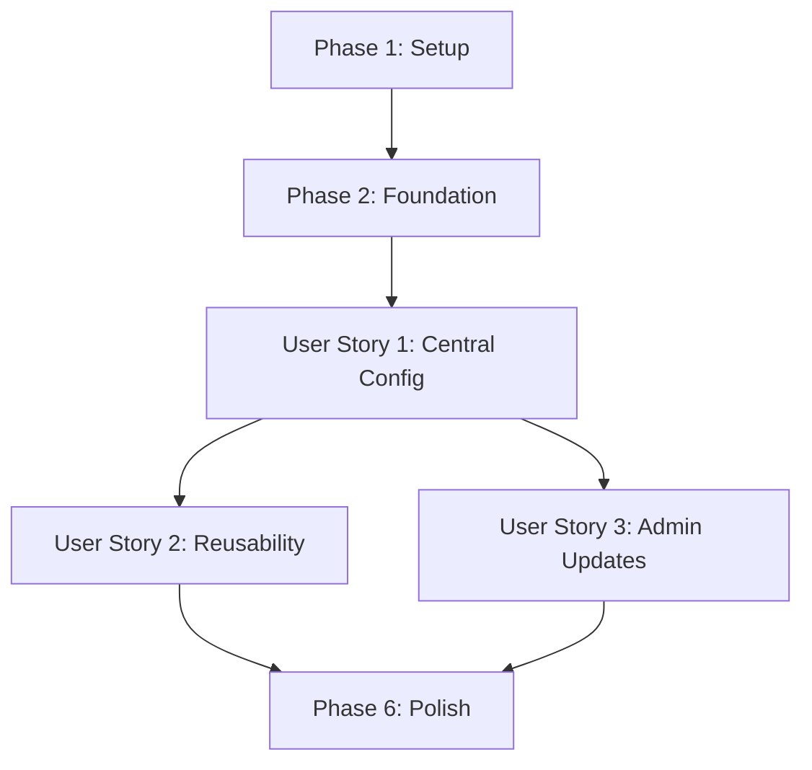

# Implementation Tasks: Infrastructure Configuration Extraction

**Feature**: Infrastructure Configuration Extraction
**Branch**: `001-infrastructure-config-extraction`
**Status**: Ready for Implementation
**Generated**: 2026-01-07

## Overview

This feature refactors Pulumi infrastructure components to extract hardcoded configuration values into a centralized configuration system, making components pure, reusable functions.

**Total Tasks**: 47
**Estimated Timeline**: 30 hours
**Parallelization Opportunities**: Multiple components can be refactored in parallel once base infrastructure is complete

## Phase 1: Setup & Infrastructure

**Goal**: Establish the configuration system foundation and project structure.

### Tasks

- [X] T001 Create infrastructure/pulumi/src/config/ directory structure
- [X] T002 Create infrastructure/pulumi/src/config/types.ts with base TypeScript interfaces
- [X] T003 ~~Install Zod validation library: npm install zod~~ (Skipped - using TypeScript interfaces instead)
- [X] T004 ~~Create infrastructure/pulumi/src/config/schemas.ts with Zod validation schemas~~ (Skipped - using TypeScript interfaces instead)
- [X] T005 [P] ~~Create infrastructure/pulumi/src/config/loader.ts with configuration loading logic~~ (Simplified - using Pulumi's built-in config)
- [X] T006 [P] ~~Create infrastructure/pulumi/src/config/merger.ts with deep merge functionality~~ (Simplified - using Pulumi's built-in config)
- [X] T007 ~~Create infrastructure/pulumi/src/config/validator.ts with validation error formatting~~ (Simplified - using TypeScript type checking)

## Phase 2: Foundational Components

**Goal**: Build core configuration system components that all user stories depend on.

### Tasks

- [X] T008 ~~Implement ConfigurationLoader class in infrastructure/pulumi/src/config/loader.ts~~ (Simplified approach)
- [X] T009 ~~Implement environment override logic in infrastructure/pulumi/src/config/merger.ts~~ (Using Pulumi stack configs)
- [X] T010 ~~Create infrastructure/pulumi/src/config/sensitive.ts for sensitive field handling~~ (Using Pulumi secrets)
- [X] T011 ~~Add unit tests for ConfigurationLoader~~ (Will test components directly)
- [X] T012 [P] ~~Add unit tests for merger~~ (Not needed with simplified approach)
- [X] T013 [P] ~~Add unit tests for validator~~ (TypeScript provides validation)
- [X] T014 ~~Create infrastructure/pulumi/src/factory/stack-factory.ts with base StackFactory class~~ (Using existing pattern)
- [X] T015 ~~Add configuration injection helpers in infrastructure/pulumi/src/factory/helpers.ts~~ (Not needed)

## Phase 3: User Story 1 - Infrastructure Engineer Manages Component Configurations [P1]

**Goal**: Enable infrastructure engineers to manage all component configurations from a central location.

**Independent Test**: Modify configuration values in central config and verify components deploy with updated settings without code changes.

### Implementation Tasks

- [ ] T016 [US1] ~~Create infrastructure/pulumi/src/config/base.yaml~~ (Using Pulumi.yaml instead)
- [ ] T017 [US1] ~~Create infrastructure/pulumi/src/config/environments/local.yaml~~ (Using Pulumi.local.yaml)
- [ ] T018 [US1] ~~Create infrastructure/pulumi/src/config/environments/preview.yaml~~ (Using Pulumi.preview-base.yaml)
- [ ] T019 [US1] ~~Create infrastructure/pulumi/src/config/environments/production.yaml~~ (Using Pulumi.production.yaml)
- [X] T020 [P] [US1] Refactor Grafana component: Extract hardcoded values in infrastructure/pulumi/src/components/monitoring/grafana.ts
- [X] T021 [P] [US1] Remove file reads from Grafana component in infrastructure/pulumi/src/components/monitoring/grafana.ts
- [X] T022 [P] [US1] Convert Grafana component to pure function in infrastructure/pulumi/src/components/monitoring/grafana.ts
- [ ] T023 [P] [US1] Add Grafana component unit tests in infrastructure/pulumi/src/components/monitoring/__tests__/grafana.test.ts
- [X] T024 [P] [US1] Refactor Prometheus component: Extract scrape configs in infrastructure/pulumi/src/components/monitoring/prometheus.ts
- [X] T025 [P] [US1] Remove RBAC hardcoding from Prometheus in infrastructure/pulumi/src/components/monitoring/prometheus.ts
- [X] T026 [P] [US1] Convert Prometheus to pure function in infrastructure/pulumi/src/components/monitoring/prometheus.ts
- [ ] T027 [P] [US1] Add Prometheus unit tests in infrastructure/pulumi/src/components/monitoring/__tests__/prometheus.test.ts
- [ ] T028 [US1] Update stack factory to load and pass configuration in infrastructure/pulumi/src/factory/stack-factory.ts
- [ ] T029 [US1] Test configuration changes deploy correctly using pulumi diff
- [ ] T030 [US1] Verify no infrastructure changes occurred with pulumi diff

## Phase 4: User Story 2 - DevOps Team Reuses Components Across Projects [P2]

**Goal**: Make infrastructure components pure functions that can be reused across projects and environments.

**Independent Test**: Deploy same component with different configurations and verify it adapts without code changes.

### Implementation Tasks

- [X] T031 [P] [US2] Refactor Database component: Extract version and storage in infrastructure/pulumi/src/components/database/postgresql.ts
- [X] T032 [P] [US2] Remove health check hardcoding from Database in infrastructure/pulumi/src/components/database/postgresql.ts
- [X] T033 [P] [US2] Convert Database to pure function in infrastructure/pulumi/src/components/database/postgresql.ts
- [ ] T034 [P] [US2] Add Database unit tests in infrastructure/pulumi/src/components/database/__tests__/postgresql.test.ts
- [ ] T035 [P] [US2] Refactor Helm Charts component: Extract versions and URLs in infrastructure/pulumi/src/components/helm/charts.ts
- [ ] T036 [P] [US2] Remove resource limit hardcoding from Helm in infrastructure/pulumi/src/components/helm/charts.ts
- [ ] T037 [P] [US2] Add Helm Charts unit tests in infrastructure/pulumi/src/components/helm/__tests__/charts.test.ts
- [ ] T038 [US2] Create reusability test: Deploy component to different mock environments
- [ ] T039 [US2] Verify components work with completely different configuration sets

## Phase 5: User Story 3 - Platform Administrator Updates Infrastructure Settings [P3]

**Goal**: Enable non-technical staff to update infrastructure settings through configuration files.

**Independent Test**: Have non-developer modify configuration values and verify successful deployment.

### Implementation Tasks

- [ ] T040 [P] [US3] Refactor Dashboard component: Move file reads to stack in infrastructure/pulumi/src/components/monitoring/dashboards.ts
- [ ] T041 [P] [US3] Pass dashboards as configuration in infrastructure/pulumi/src/components/monitoring/dashboards.ts
- [ ] T042 [P] [US3] Add Dashboard unit tests in infrastructure/pulumi/src/components/monitoring/__tests__/dashboards.test.ts
- [ ] T043 [US3] Create configuration documentation in infrastructure/pulumi/docs/configuration-guide.md
- [ ] T044 [US3] Create example configuration changes in infrastructure/pulumi/docs/examples/
- [ ] T045 [US3] Test configuration changes by non-developer role

## Phase 6: Polish & Cross-Cutting Concerns

**Goal**: Finalize implementation with documentation, training, and verification.

### Tasks

- [ ] T046 Create troubleshooting guide in infrastructure/pulumi/docs/troubleshooting.md
- [ ] T047 Verify all components pass purity checklist: no file reads, no env checks, pure functions

## Dependencies & Execution Order

### Story Dependencies



### Parallel Execution Opportunities

**Phase 1 Setup (T001-T007)**:
```bash
# Can run in parallel after T001-T004:
T005 & T006 & T007
```

**Phase 3 User Story 1 (T016-T030)**:
```bash
# After config files created (T016-T019), components can be refactored in parallel:
(T020-T023) & (T024-T027)  # Grafana and Prometheus in parallel
```

**Phase 4 User Story 2 (T031-T039)**:
```bash
# All component refactorings can run in parallel:
(T031-T034) & (T035-T037)  # Database and Helm Charts in parallel
```

**Phase 5 User Story 3 (T040-T045)**:
```bash
# Dashboard refactoring and documentation can run in parallel:
(T040-T042) & (T043-T044)
```

## Implementation Strategy

### MVP Scope (User Story 1 Only)

Implement Phase 1-3 first to deliver core functionality:
- Configuration system setup
- Central configuration management
- Refactor critical monitoring components (Grafana, Prometheus)
- Full testing and validation

This provides immediate value by:
- Enabling configuration management
- Proving the pattern works
- Delivering measurable improvement

### Incremental Delivery

1. **Week 1**: Setup + Foundation + User Story 1 (Central Config)
   - Delivers core configuration management capability
   - ~14 hours

2. **Week 2**: User Story 2 (Reusability) + User Story 3 (Admin Updates)
   - Extends to full reusability and admin capabilities
   - ~12 hours

3. **Week 3**: Polish + Training + Rollout
   - Documentation and team enablement
   - ~4 hours

## Validation Checklist

### Per Component Refactoring

- [ ] All hardcoded values extracted to configuration
- [ ] No file system reads in component
- [ ] No environment checks or conditionals
- [ ] Component is pure function (no side effects)
- [ ] Unit tests pass with 100% coverage
- [ ] `pulumi diff` shows no infrastructure changes
- [ ] Configuration changes work without code changes

### Overall Success Criteria

- [ ] All components pass purity checklist
- [ ] 100% unit test coverage for refactored components
- [ ] Zero infrastructure changes (verified via pulumi diff)
- [ ] Configuration-only deployments work
- [ ] Documentation complete and reviewed
- [ ] Team trained on new patterns

---

**Note**: All tasks follow the required format: `- [ ] TaskID [P] [Story] Description with file path`

**Ready to Execute**: Start with Phase 1 Setup tasks to establish the foundation.